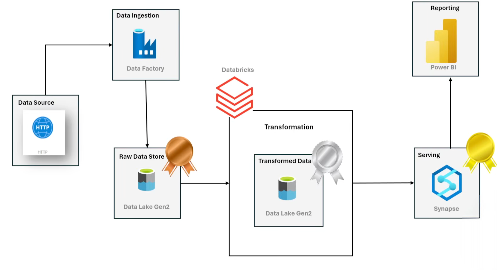

# 🚀 Adventure Works Data Engineering Project  
## End-to-End Azure Data Pipeline Using the Medallion Architecture (Bronze → Silver → Gold)

This project demonstrates a full data engineering solution built on **Azure**, following the **Medallion Architecture** (Bronze → Silver → Gold).  
Data flows from ingestion → raw storage → transformation → serving → reporting.

The goal is to build a scalable, industry-standard analytics platform using:

- Azure Data Factory (ADF)  
- Azure Data Lake Storage Gen2 (ADLS Gen2)  
- Azure Databricks  
- Azure Synapse Serverless SQL  
- Power BI  

---

# 🏗️ Architecture Overview

This project uses the **Medallion Architecture**:

- 🥉 Bronze → Raw, unprocessed data  
- 🥈 Silver → Cleaned, structured, validated data  
- 🥇 Gold → Business-ready analytics layer
  
### 🧱 Solution Architecture Diagram

### 🧩 Pipeline Flow

